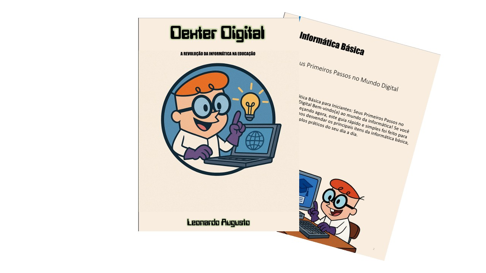

# Projeto EBOOK Gerado por I.A.s

 > ℹ️ **NOTE:** Este é o repositório desenvolvido durante o curso !

Projeto com o objetivo de gerar um ebook digital com as facilidades das ferramentas de IA. todos os prompts
seguem abaixo.

<a href="https://github.com/leoaugustofp-oss/prompts-recipe-to-create-a-ebook/blob/main/output/ebook%20-%20Dexter%20Digital.pdf" title="View PDF now"> 📕Clique aqui para ler</a>

## 💻 Tecnologias utilizadas no projeto

- [ChatGPT](https://chat.openai.com/) 
- [MidJourney](https://www.midjourney.com/app/)
- [PowerPoint](https://www.microsoft.com/en/microsoft-365/powerpoint)

## 🧠 Prompts

ChatGPT：

|   Ação   | prompt                                                                                                                                                                                                                                                                         |
| :------: | ------------------------------------------------------------------------------------------------------------------------------------------------------------------------------------------------------------------------------------------------------------------------------ |
|  título  | Crie um titulo de um ebook sobre o tema de Informatica, o ebook é do nicho educação e o subnicho e de informatica, o titulo deve ser épico e curto, e tenha uma temática do desenho dexter no titulo, me liste 5 variações                                                  |
| conteúdo | faça um texto para ebook, com foco em informática básica, listando os principais itens com exemplos de informática para iniciantes, {regras} explique sempre de uma maneira simples, deixe o texto enxuto,sempre traga exemplos de uso do dia a dia, sempre deixe um titulo sugestivo por tópico |

Midjourney：

|  Ação  | prompt                                                                                 |
| :----: | -------------------------------------------------------------------------------------- |
| título | Crie uma imagem com tema relacionado a educação e tecnologia. combine os temas e o crie com base no desenho do dexter --v 5.1 |

## ✨ Features

- Conteúdo gerado via ChatGPT
- Imagens geradas via MidJourney

## 📚 Materiais

- Imagens utilizadas em `assets`
- ebook gerado durante as aulas em `output`

## 🛠️ Instruções de execução

Utilize os prompts acima nas ferramentas sugeridas para gerar o material base e utilize uma ferramenta de edição de documentos como power point, libreoffice , indesign para diagramação.

---

 por [Leonardo Augusto](https://github.com/leoaugustofp-oss)
